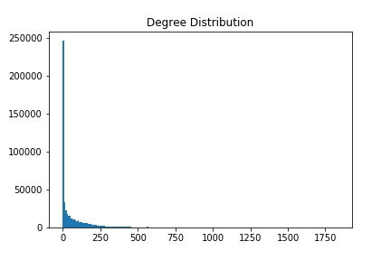

## Network
A network was build to examine whether certain actors dominate certain genres, in the sense that the same actors star in many different movies from the same genre.

The network consists of movies as nodes and actors as edges. If an actor stars in two different movies, these movies are connected with an edge. Nodes and edges also contain different attributes. A movie node contains the name of the movie and the genres of the movie whereas the edges only contain the actor names which connects two nodes.

The network consists of 527,345 different movies (nodes) and 19,461,220 edges, where each edge can represent one or more actors, i.e. each edge contains all the actors connecting the two given movies. Because of the size of the network it can not be shown, as it would be incomprehensible.

The initial analysis of the network included making a degree distribution.

It is seen that the degree distribution follows a power-law distribution. It is seen that many movies have a very low degree. This makes sense since there are likely 

[Next page: Conclusion](conclusion.md)
