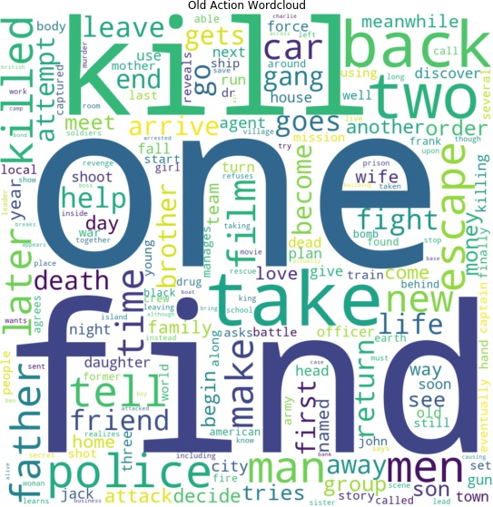
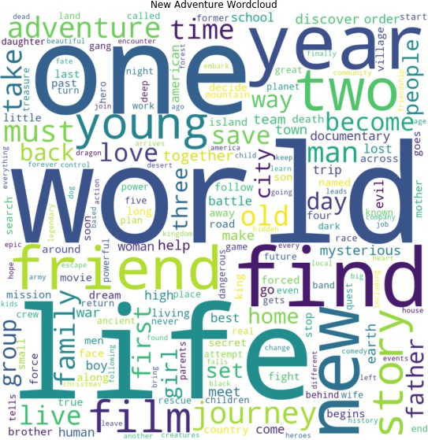
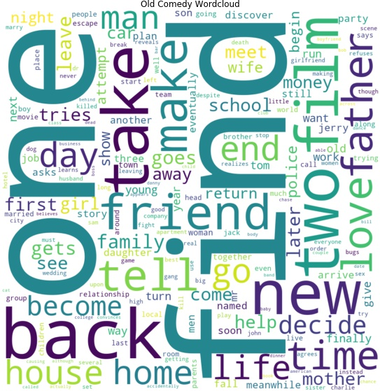
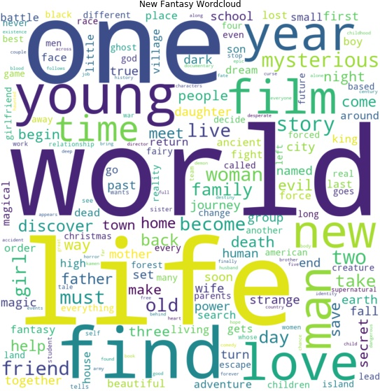
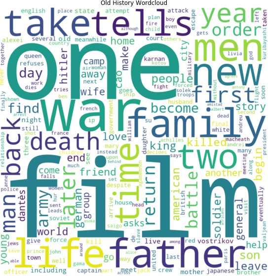
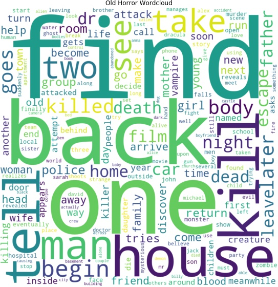

## Word Clouds

Word clouds have been created for old movies and new movies separately for each of 17 different genres to see how they changed over time.

**Click on a genre to expand and see the word clouds:**
<!-- Markdown is not completely supported within 
 tag so images must be inserted with html syntax -->

  
Action

  
  

  The action genre for old and new movies are quite similar but there are some words which have been replaced. For example the word "kill" which is very often present in older movie plots where it is almost completely gone for new movie plots. Instead words such as "life", "world", and "man" occur more often.

    

  
Adventure

  
  

  For older adventure movies words like "escape", "return", "back", "find", and "take" occur more often than in newer adventure movies where again "world" and "life" are more often used. The word "one" is seen for both old and new which could mean that they both revolve around a single protagonist who needs to escape or find something or about their life in general.

    

  
Animation

  
  

  For old animation movies certain names such as Daffy, Tom and Jerry are often used in plot descriptions which could mean that cartoons with these characters dominate the genre. Again words like "life" and "world" are often used in the newer plot descriptions, but also "new" and "friend" are much more present for newer movies. In both old and new movies the words "one" and "find" are present.

    

  
Biography

  
  

  In the biography genre the words "one" and "life" occur often for both old and new movies, which makes sense since biographies often revolve around a certain person who has accomplished something remarkable in their life. Notably the word "documentary" are present in the word cloud for new movies which is a clear sign of genres being mixed since many movies include several genres. Furthermore the word "film" occurs often in the plot descriptions. This could be due to the type of genre since a biography is often based on facts and the word "film" is seen often also seen in plot descriptions for the genres; Documentary, History, and News.

    

  
Comedy

  
  

  Again the words "one" and "find" are often present for both old and new movies. Also the words "new", "friend", and "life" are present in both where the latter two are more present in new movies. Furthermore the word "love" is often used in plot descriptions for new movies and could again be a sign of genre mixing since there are probably many movies in the romantic comedy genre.

    

  
Crime

  
  

  The word cloud for old crime movies are very different from the word clouds seen previously since there are many names of persons and/or places where as the word cloud for new crime movies include words such as "life", "one", "find", and "new", which is also seen in several other word clouds, especially for new movies.

    

  
Documentary

  
  

  

    

  
Drama

  
  

  Text

    

  
Fantasy

  
  

  Text

    

  
History

  
  

  Text

    

  
Horror

  
  

  Text

    

  
Music

  
  

  Text

    

  
Musical

  
  

  Text

    

  
Mystery

  
  

  Text

    

  
News

  
  

  Text

    

  
Thriller

  
  

    

  
Western

  
  

  As seen on the word clouds above old and new western movies are very similar and very clear what entities are often in western movies, such as a town, some outlaws, a sheriff, and a man or men who are fighting the outlaws to protect the town and their family.

    

### Overall Comparison

[Next page: Sentiment](sentiment.md)
