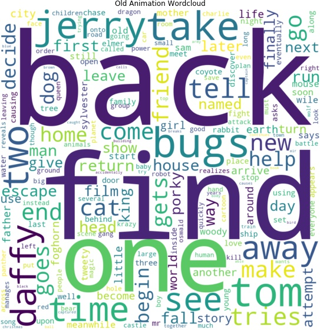
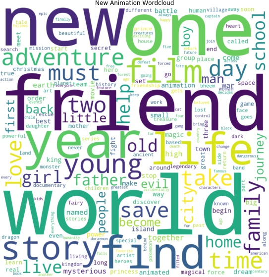
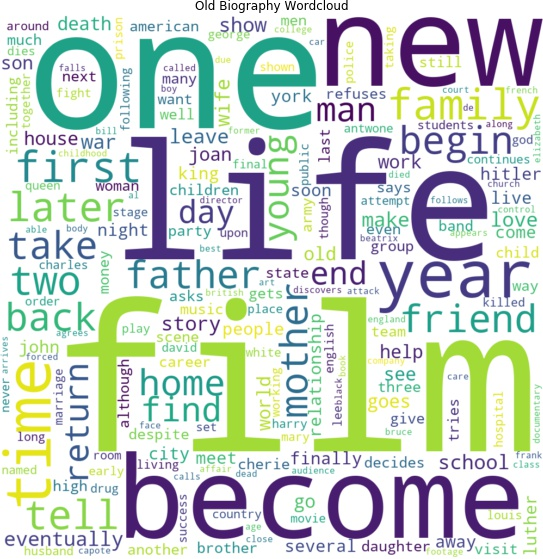
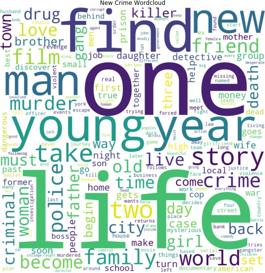
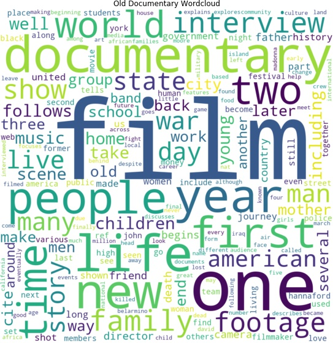
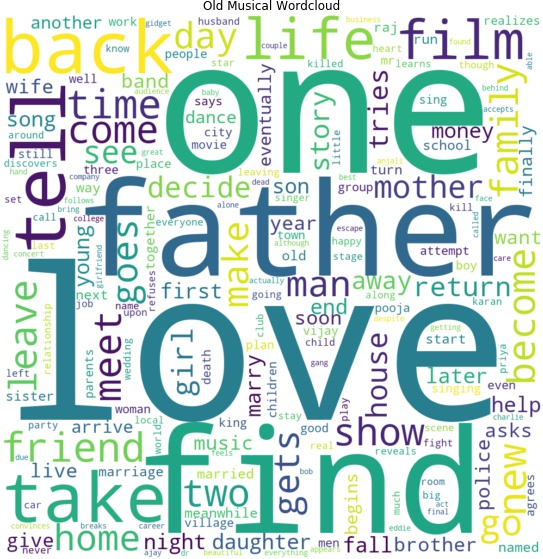

## Word Clouds

Word clouds have been created for old movies and new movies separately for each of 17 different genres to see how they changed over time.

**Click on a genre to expand and see the word clouds:**
<!-- Markdown is not completely supported within 
 tag so images must be inserted with html syntax -->

  
Action

  
  

  The action genre for old and new movies are quite similar but there are some words which have been replaced. For example the word "kill" which is very often present in older movie plots is almost completely gone for new movie plots. Instead words such as "life", "world", and "man" occur more frequently.

    

  
Adventure

  
  

  For older adventure movies, words like "escape", "return", "back", "find", and "take" occur more often than in newer adventure movies where once again the words "world" and "life" are more frequent. When taking a closer look, the two categories do have some similarities in the plots described. Both new and old adventure movies seem to describe some type of journey, using words such as "arrive", "return", "go", and "leave" for old movies, and "back", "trip", and "journey" for new movies. 

    

  
Animation

  
  

  For old animation movies certain names such as Daffy, Tom and Jerry are often used in plot descriptions which could mean that cartoons with these characters dominate the genre. Again words like "life" and "world" are often used in the newer plot descriptions, but also "new" and "friend" are much more present for newer movies. In both old and new movies the words "one" and "find" are present. It is interesting to see the distinct shift in the complexity of plots going from old to new movies. New animation films seem to be much more simliar to other genres, suggesting a more common plotline, while old movies seem to be very centered around the characters rather than a deep plot. 

    

  
Biography

  
  

  In the biography genre the words "one" and "life" occur often for both old and new movies, which makes sense since biographies often revolve around the life of some person. Notably the word "documentary" are present in the word cloud for new movies which is a clear sign of genres being mixed since many movies include several genres. Furthermore the word "film" occurs frequently in the plot descriptions. This could be due to the type of genre since a biography is often based on facts and the word "film" is also seen in plot descriptions for the genres; Documentary, History, and News likely due to the need to clarify that the production is a film rather than an episode. This is typically not necessary in more traditional movie genres such as comedy and adventure. 

    

  
Comedy

  
  

  Again the words "one" and "find" are often present for both old and new movies. Also the words "new", "friend", and "life" are present in both where the latter two are more present in new movies. Furthermore the word "love" is often used in plot descriptions for new movies and could again be a sign of genre mixing since there are probably many movies in the romantic comedy genre.

    

  
Crime

  
  

  The word cloud for old crime movies are very different from the word clouds seen previously since there are many names of persons and/or places where as the word cloud for new crime movies include words such as "life", "one", "find", and "new", which is also seen in several other word clouds, especially for new movies.

    

  
Documentary

  
  

  For the documentary genre both old and new plot descriptions often use the words "documentary" and "film". The words "world" and "life" are used for both old and new movies but again more often for new movies. Furthermore words such as "year", "story", "family", "war", "people" and "one" are used for both old and new movies, some more in old and some more in new movies.

    

  
Drama

  
  

  Once again "one" and "life" are often used. The words "love", "film", "find", and "family" are also used in both. In fact it is clear that a large aspect of drama movies is "family", since also words like "father", "mother", "home", "friend", and "son" are used in both old and new movies.

    

  
Fantasy

  
  

  Again there are several words included in both old and new movie plot description which have also been used in many previous plot descriptions. These are for example "find" and "one" which are used for both old and new and "world" and "life" which is used much more for new movies. For old movies the words "back" and "return" are used much more than for new movies, where "young" and "love" are used more frequently in new movie plots.

    

  
History

  
  

  Once again "one" and "life" is present in both word clouds as well as the word "film". In the word cloud for new history movies the word documentary is present which it is not for old movies. This can again be a sign of mixing genres. Furthermore there is more focus on war in old history movies since the word "war" is more frequently used as well as words like "death", "battle", "soldier", "army" and "Hitler". Some of these words are also present in the new history movie word cloud but much less frequently.  

    

  
Horror

  
  

  The words "find" and "one" are again present for both old and new movies and there are many words which fit the genre well in both old and new such as "house", "night", "kill", "killer", "death", "dead", and "body" for old horror movies and "house", "night", "killer", "dead", and "terrifying" for new horror movies. But as with the action movies the word "kill" and similar words are much less used in the new movie plots compared to the old. Furthermore a word like "zombie" appears for new movies but not for old ones and on the other hand a word like "dr" (assumed to be short for doctor) appears for old movies but not new movies.

    

  
Music

  
  

    

  
Musical

  
  

  Several of the more frequent words occur in both old and new movie plots. Frequent words like "life" and "film" occurs often in new movies but as much in old ones. Other frequent words like "one", "love", "find", and "father" occurs more often in old movies compared to new ones. Furthermore the word "music" occurs more often in new movie plots as well as the word "musical" which is not in the old movie plots at all.

    

  
Mystery

  
  

  The words "find", and "one" are once again very frequent in both new and old. The word "life" is very frequent for new movies but not as much for old movies. In the old movie plots the words "killer", "killed", "kill", and "murder" are much more frequent compared to new movies which is the same pattern as seen in the action and horror genres. Words like "mystery" and "mysterious" is more frequent in the new movie plots compared to the old ones.

    

  
News

  
  

  In the news genre the word cloud for old movie plots contain many words and names like "bosnian", "Yugoslavia", "Kosovo", "serb", and "yugoslav" which are not present in the new news genre word cloud. Instead again words like "one", "life", "world", and "new" are very frequent. Furthermore the word "documentary" is frequent in the new movie plots which again makes sense due to the genres that might overlap.

    

  
Thriller

  
  

  The words "find" and "one" are very frequent in both new and old thriller movie plots, where "life" is more frequent in new movie plots and "kill" more frequent in old movie plots. For old movies plots the words "police" and "take" are more frequent, in fact "police" is not present at all for new movies. Instead words like "friend", "family" and "young" are more frequent.

    

  
Western

  
  

  As seen on the word clouds above old and new western movies are very similar and it is very clear what entities are often in western movies, such as a "town", "outlaws", "sheriff", and "man" or "men" who are fighting the outlaws to protect the town and their family. Again the word "one" appears frequently in both, where "life" again is much more frequent in new. The old movie plots contain the words "kill" and "killed" more frequently than the new movie plots. Furthermore words like "take", "back", "horse", and "indian" are more frequent for the old movies.

    

### Overall Comparison
Overall there is not much change from old to new movies since many words in the word clouds fit their genre very well. Although this might also suggest that old and new movies have not changed over time, e.g. that new action movies are the same as old action movies based on this. It is also seen in some genres that the frequent words gets less violent from old to new. This is for example seen in the action, horror, and thriller genres, where the words "kill" are very frequent in the old movie plot descriptions but not in the new ones. **Why could this be?**

[Next page: Sentiment](sentiment.md)
